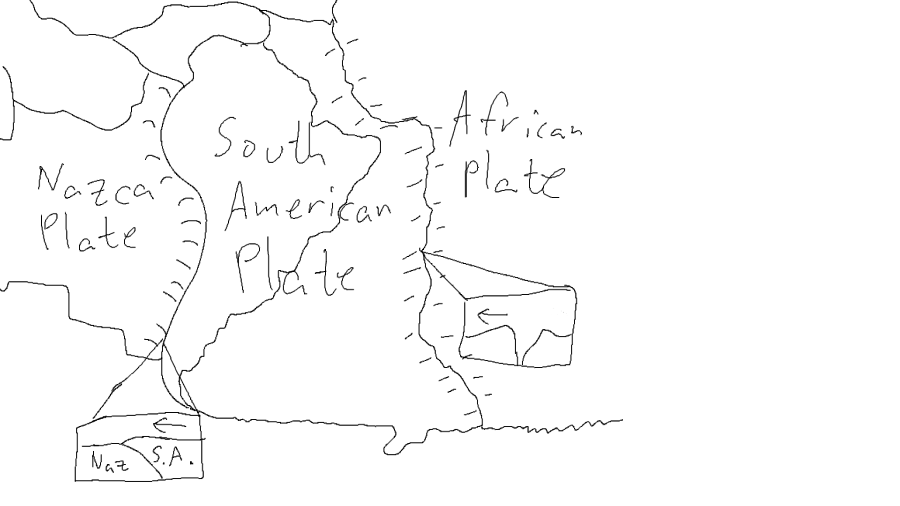

# Weekly Activity 2: A Continent and Its Plate
## Continent/Plate

South America
South American Plate

## Coastlines/Continent Boundaries

The continent of South America aptly resides on the South American tectonic plate. The pacific border of the plate sits on the border of the continent, however the Atlantic side has a lot of leeway before bordering the African plate.

### Pacific

The pacific coast of the South American plate borders the Nazca plate. This plate boundary is entirely convergent. The Nazca plate and the South American plate are converging into one another. Specifically, the Nazca plate is being subducted beneath South America at the Peru-Chilean Trench. This plate boundary is an active margin.

### Atlantic

Although the Atlantic coast of South America does not border another tectonic plate, the Atlantic Ridge next to the continent does. It borders the African plate at a mostly divergent boundary, with several places where the plates meet at transform boundaries. The South American plate seems to be heading generally westward away from the African plate, colliding with the Nazca plate. This plate boundary is a passive margin.

## Pangea

During the Mesozoic era and when the super continent Pangea existed, South America was positioned next to Africa, nestled together. Over time the continent drifted away westward. It was also pushed closer to the North American plate and they separated slightly as well. The continent split from the rest of Pangea during the Jurassic Period, around 180 million years ago.

## Observations

1. The high amount of volcanic and earthquake activity along the western edge of the South American continent supports the idea that that border is an active margin and is colliding with the oceanic plate it sits against.
2. The low amount of any plate activity, volcanic or otherwise, along the eastern edge of the South American coast as well as in the Southern Mid Atlantic ridge indicates the plate is moving away from the African plate.
3. The large oceanic trench along the western coast of South America (The Peru-Chilean Trench) indicates that the Nazca plate is being pushed under the South American plate.

## Diagram 

## References
Randell, A. (2015, March 4). _Chile gives us a lesson in plate tectonics_. Geology for Investors. Retrieved January 28, 2022, from https://www.geologyforinvestors.com/chile-lesson-plate-tectonics/

